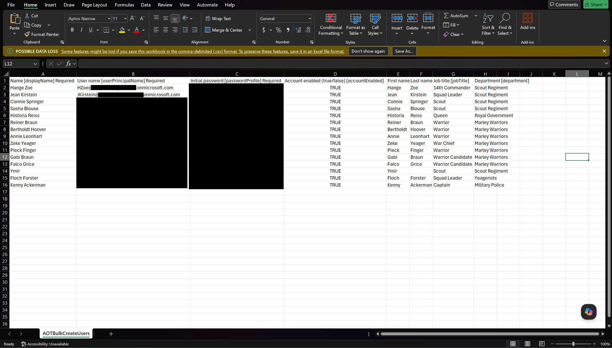
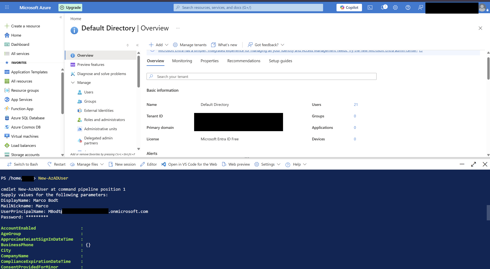
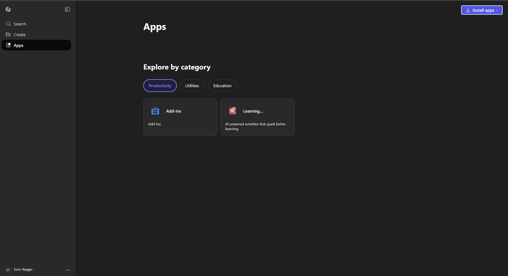
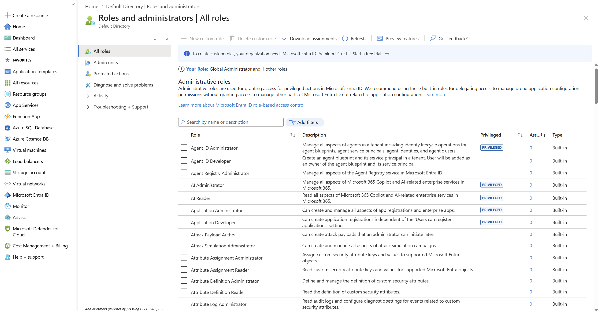
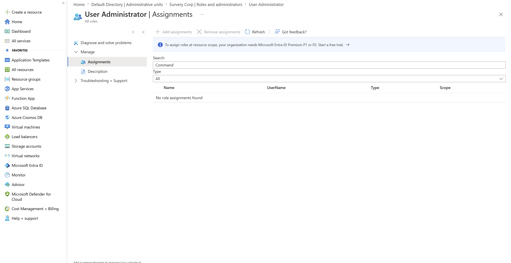

# Azure Entra ID Home Lab
## User Management and Help Desk Fundamentals

---

## Overview

This lab covers foundational Azure Entra ID (formerly Azure Active Directory) tasks including user provisioning, device management concepts, and simulating an end-user login experience. This lab is themed from "Attack on Titan" (one of my favorite tv shows), with characters mapped to employee roles.

**Platform:** Microsoft Azure (Free Trial)
**Admin Center:** portal.azure.com / Entra Admin Center

---

## Section 1: Manual User Creation

**Location:** Entra Admin Center > Users > New User

I navigated to portal.azure.com and accessed the Entra Admin Center. Created the following users manually, one at a time, by entering each user's info:

- Eren Yeager
- Mikasa Ackerman
- Armin Arlert
- Levi Ackerman
- Erwin Smith

**Note on UPN format:** Because this tenant does not have a custom domain attached, all usernames follow the default `.onmicrosoft.com` format appended to the admin's email domain (e.g., `eren@[tenant].onmicrosoft.com`). In a production environment, this would be replaced with the organization's verified custom domain. I didn't want to purchase a domain since the point of this lab is practice.

---

## Section 2: Bulk User Creation via CSV

**Location:** Entra Admin Center > Users > Bulk Operations > Bulk Create

You can bulk create multiple users by adding their info to a properly formatted CSV file; I downloaded Microsoft's sample CSV template from the Bulk Create wizard. Modified the template using Copilot to add remaining AOT characters with appropriate display names, usernames, and temporary passwords. Uploaded the completed CSV file through the wizard.

All users were successfully added to the tenant.



From what I understand, bulk creation is ideal during large-scale onboarding events, department migrations, or company acquisitions where dozens or hundreds of accounts need to be provisioned at once.

---

## Section 3: User Creation via PowerShell (Cloud Shell)

**Location:** Azure Portal > Cloud Shell (top navigation bar)

I also wanted hands-on practice with adding new users via shell, so I launched the Azure Cloud Shell directly from the portal. Used the following command to create an additional user via command line:

```powershell
New-AzADUser
```

The command prompted for required fields including display name, username, and password. The user was created successfully. Pretty simple and straightforward.



**Note:** Apparently `New-AzADUser` is part of the older Az PowerShell module. Current Microsoft documentation recommends `New-MgUser` from the Microsoft Graph module for new implementations. Both accomplish the same task.

---

## Section 4: Device Management Concepts

Before attempting device registration, reviewed the three device states in Azure Entra ID:

| State | Description | Use Case |
|---|---|---|
| Registered | You OWN it and LOGIN to it with your own info | Device is known to Azure but not managed. User retains personal ownership. | BYOD (personal phones, laptops checking work email) |
| Joined | Device is fully corporate-managed via Azure. No on-premises AD required. | Cloud-only org-issued devices |
| Hybrid Joined | Device is joined to both on-premises Active Directory and Azure Entra ID. | Organizations mid-transition from on-premises to cloud |

I did attempt deploying a Windows 10 VM in Azure to practice device registration, but got blocked by Azure free trial limitations. Free trial accounts cap total vCPU usage and restrict certain Windows 10 marketplace images. Because of this, I skipped VM deployment for this session. Device registration will be revisited using a Windows Server image or a local VM in a future session.

---

## Section 5: Simulating an Employee Login

My goal was to simply experience the tenant from an end-user perspective.

1. Opened a private/incognito browser window to isolate the session from the admin account
2. Navigated to `myaccount.microsoft.com`
3. Signed in as Eren using his full UPN and temporary password
4. Completed the forced password change prompt
5. Arrived at Eren's user dashboard



Eren's dashboard showed his account overview and the option to install Microsoft 365 apps. His view had no access to admin functions, confirming role-based access is working correctly.

---

## Note: Roles and Administrators

Next I got practice with configuring roles and administrators, like assigning the custom role of being able to read sign-in reports to a select couple of administrators. Why? Entra ID comes with pre-configured roles you can assign to admins, but if there aren't any that fit your needs, you can also create custom roles, with the end goal being assigning roles to admins based on their job needs so they only have authorization to complete tasks and access resources necessary to do their job. 

I'm still new to the specific roles you'd want to assign to admins, and what you'd want people to be able to do and access; but knowing HOW to configure those roles is my goal for now, and this lab helped achieve that. It's as simple as navigating to Entra Admin Center > Roles and Administrators, and then selecting the role and assigning users to it so they get access to do whatever that role allows.



---

## Note: Administrative Units

Next I hit a roadblock with administrative units. In short, based on what I've learned, administrative units are used in conjunction with groups to delegate admin access to select users. If I've created a group in an enterprise, say "Help Desk", and I want that group to have admin rights over select users in the administrative unit named "sales department", for example, I'd navigate to the roles and administrators setting of that Admin Unit and assign the "Help Desk" group the role of "User Administrator" to the admin unit, and voila, that Help Desk group now has access to help those specific users in that Admin Unit. Unfortunately with my Entra ID free trial, I could only go so far:



---

## Note: Conditional Access

A note on conditional access: from what I understand, conditional access is application-specific. Meaning, you're only granted access to that app if you meet certain conditions such as location, device IP (is it trusted or suspicious?), risk level, and others. If you meet these conditions you're granted access, if not, you're either blocked or provided guidance on how to meet compliance standards to gain conditional access once again. Conditional access differs from identity beCAUSE it's application-specific. I didn't get very far actually configuring conditional access given the restrictions on my free trial; but this is helpful to understand nonetheless.
